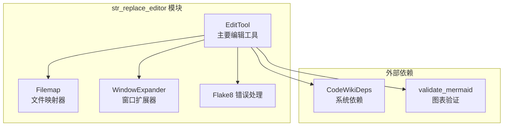
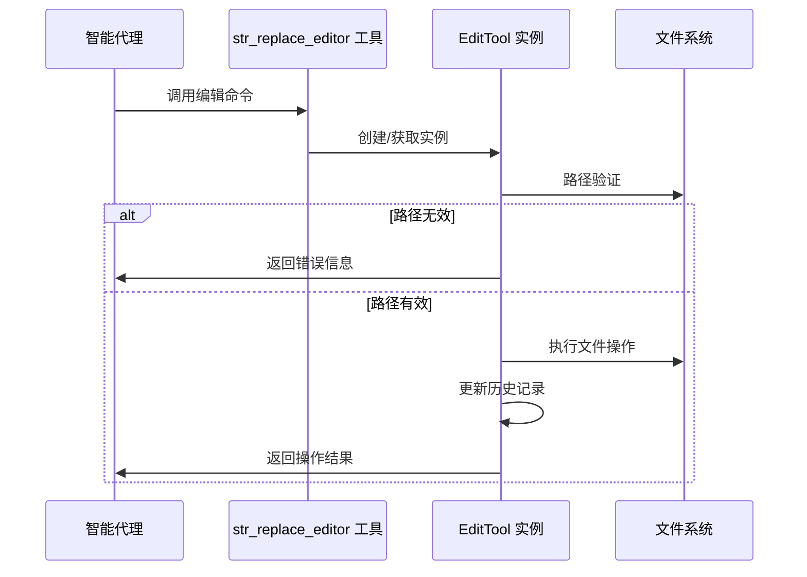
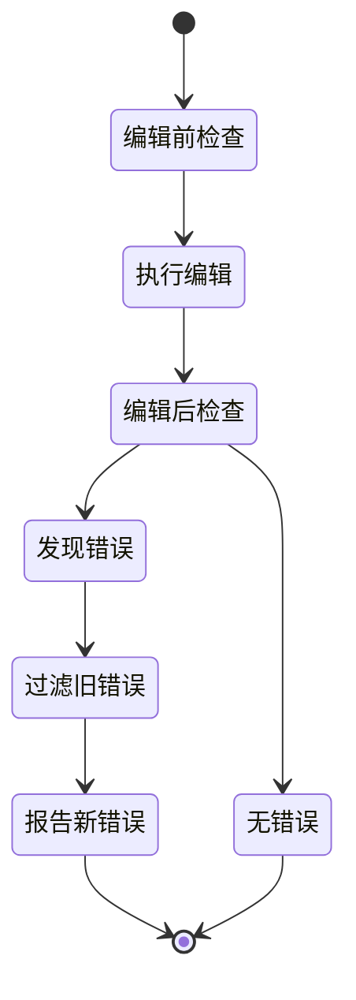
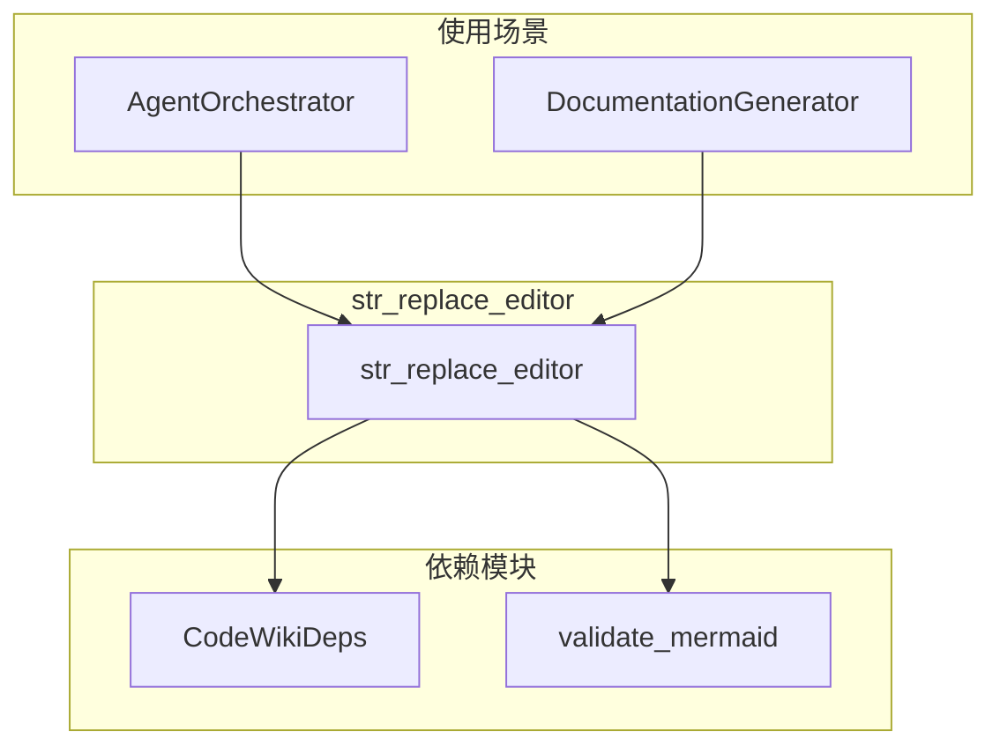

# str_replace_editor 模块文档

## 概述

str_replace_editor 模块是 CodeWiki 系统的核心文件编辑工具，为智能代理提供了一套完整的文件操作功能。该模块支持文件查看、创建、编辑、插入和撤销操作，并集成了语法检查、窗口扩展和文件映射等高级功能。

## 核心功能

### 1. 文件操作功能
- **文件查看**：支持文件和目录的查看，可指定查看范围
- **文件创建**：创建新文件，支持自动路径验证
- **字符串替换**：精确的文本替换功能，支持唯一性检查
- **内容插入**：在指定行号插入新内容
- **撤销编辑**：支持编辑历史管理和撤销操作

### 2. 智能辅助功能
- **语法检查**：集成 flake8 进行 Python 代码语法检查
- **窗口扩展**：智能扩展查看范围以包含完整的函数或类
- **文件映射**：为大型文件提供结构化视图，隐藏函数体细节
- **Mermaid 验证**：自动验证文档中的 Mermaid 图表语法

### 3. 编码和错误处理
- **多编码支持**：自动处理 UTF-8、Latin-1 等编码格式
- **错误恢复**：智能的错误处理和恢复机制
- **路径验证**：严格的路径和权限验证

## 架构设计

### 核心组件



### 数据流图



## 核心类详解

### EditTool 类

EditTool 是模块的核心类，提供了完整的文件编辑功能：

#### 主要属性
- `name`: 工具名称（"str_replace_editor"）
- `REGISTRY`: 系统注册表，用于存储文件历史
- `absolute_docs_path`: 文档目录的绝对路径
- `logs`: 操作日志列表

#### 核心方法

##### 文件查看（view）
- 支持目录和文件查看
- 可指定查看范围（行号）
- 自动处理大型文件（使用文件映射）
- 智能窗口扩展

##### 字符串替换（str_replace）
- 精确的文本替换
- 唯一性检查（防止重复替换）
- 语法检查集成
- 编辑历史管理

##### 文件创建（create）
- 自动创建父目录
- 路径验证
- 内容写入和历史记录

### Filemap 类

Filemap 类为大型 Python 文件提供结构化视图：


#### 功能特点
- 使用 Tree-sitter 进行语法分析
- 自动识别函数和类定义
- 隐藏长函数体，显示关键结构
- 保持行号对应关系

### WindowExpander 类

WindowExpander 类智能扩展查看窗口：

#### 扩展策略
- **空白行检测**：优先在空白行处扩展
- **代码结构识别**：识别函数、类、装饰器定义
- **边界处理**：正确处理文件开始和结束位置
- **最大扩展限制**：防止过度扩展

#### 扩展算法
```python
# 评分系统
空行 = 1 分
连续空行 = 2 分
函数/类定义 = 3 分
文件边界 = 3 分
```

## 错误处理机制

### 语法错误处理



### 错误过滤策略
- **窗口内错误**：编辑范围内的错误不过滤
- **旧错误更新**：调整旧错误的行号
- **新错误识别**：只报告真正由编辑引入的错误

## 配置选项

### 全局配置常量

| 常量名 | 默认值 | 说明 |
|--------|--------|------|
| MAX_RESPONSE_LEN | 16000 | 最大响应长度 |
| MAX_WINDOW_EXPANSION_VIEW | 0 | 查看时的最大扩展行数 |
| MAX_WINDOW_EXPANSION_EDIT_CONFIRM | 0 | 编辑确认时的最大扩展行数 |
| USE_FILEMAP | False | 是否启用文件映射 |
| USE_LINTER | False | 是否启用语法检查 |
| SNIPPET_LINES | 4 | 编辑摘要的上下文行数 |

### 运行时配置
- 支持通过参数动态调整配置
- 可根据文件类型自动选择策略
- 支持编码格式自动检测

## 使用示例

### 基本文件操作

```python
# 查看文件
str_replace_editor(
    working_dir="docs",
    command="view", 
    path="./example.md"
)

# 创建文件
str_replace_editor(
    working_dir="docs",
    command="create",
    path="./new_file.md",
    file_text="# 新文件内容"
)

# 替换内容
str_replace_editor(
    working_dir="docs", 
    command="str_replace",
    path="./example.md",
    old_str="旧内容",
    new_str="新内容"
)
```

### 高级功能

```python
# 指定查看范围
str_replace_editor(
    working_dir="docs",
    command="view",
    path="./large_file.py",
    view_range=[1, 50]  # 查看第1-50行
)

# 插入内容
str_replace_editor(
    working_dir="docs",
    command="insert", 
    path="./example.md",
    insert_line=10,
    new_str="插入的新内容"
)

# 撤销编辑
str_replace_editor(
    working_dir="docs",
    command="undo_edit",
    path="./example.md"
)
```

## 集成关系

### 与系统其他模块的关系



### 依赖注入
- 通过 `CodeWikiDeps` 获取系统配置
- 支持文档和代码仓库两种工作模式
- 自动处理路径转换和验证

## 性能优化

### 大文件处理
- 智能截断机制，避免内存溢出
- 文件映射功能，提供结构化视图
- 增量加载策略

### 错误处理优化
- 缓存机制减少重复检查
- 增量错误分析
- 智能错误过滤

## 安全考虑

### 路径安全
- 强制使用绝对路径
- 路径存在性验证
- 防止目录遍历攻击

### 文件操作安全
- 原子性文件写入
- 编辑历史备份
- 操作权限检查

## 扩展性

### 插件支持
- 支持自定义语法检查器
- 可扩展的文件类型支持
- 自定义窗口扩展策略

### 配置灵活性
- 全局配置常量可调
- 运行时参数配置
- 文件类型特定配置

## 最佳实践

### 使用建议
1. **工作目录选择**：文档编辑使用 "docs"，代码查看使用 "repo"
2. **路径规范**：始终使用绝对路径
3. **范围查看**：大文件建议使用 view_range 参数
4. **错误处理**：关注语法检查报告，及时修正错误

### 性能建议
1. **大文件处理**：启用文件映射功能
2. **批量操作**：合理使用编辑历史
3. **语法检查**：开发阶段启用，生产环境可关闭

## 故障排除

### 常见问题
- **路径错误**：确保使用绝对路径
- **编码问题**：自动检测失败时手动指定编码
- **权限问题**：检查文件系统权限
- **语法错误**：仔细查看错误报告和行号信息

### 调试技巧
- 查看操作日志获取详细信息
- 使用 undo_edit 撤销问题编辑
- 分段查看大文件定位问题
- 验证 Mermaid 图表语法正确性