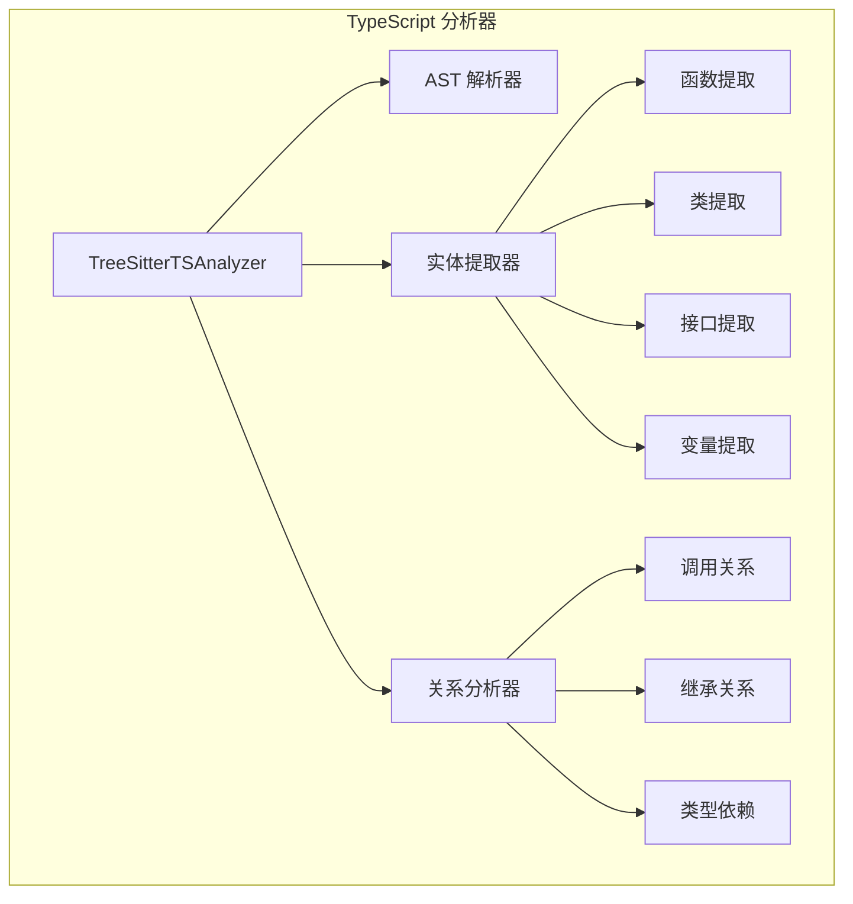
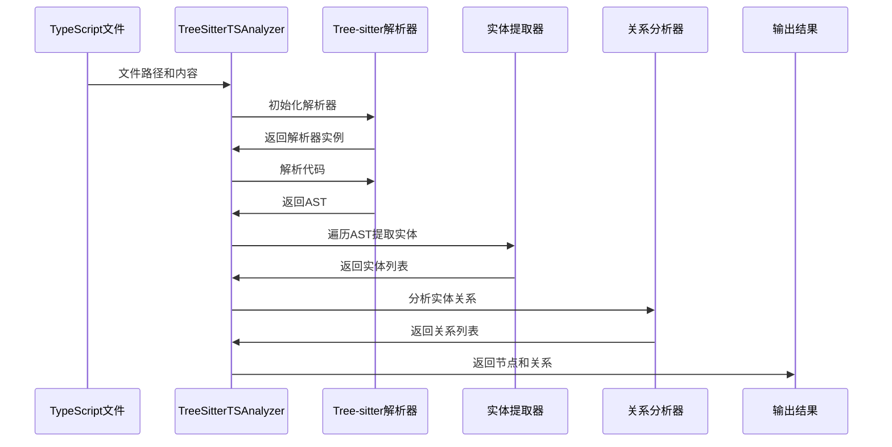

# TypeScript 分析器模块文档

## 概述

TypeScript 分析器模块（`typescript_analyzer`）是 CodeWiki 依赖分析系统中的一个核心语言分析组件，专门用于解析和分析 TypeScript 代码文件。该模块基于 Tree-sitter 解析器技术，能够提取代码中的实体（如函数、类、接口等）和它们之间的调用关系，为代码依赖分析提供基础数据。

## 核心功能

### 1. 代码解析
- 使用 Tree-sitter TypeScript 解析器将源代码转换为抽象语法树（AST）
- 支持 TypeScript 和 TSX 文件格式
- 处理各种 TypeScript 语法结构，包括现代 TypeScript 特性

### 2. 实体提取
- **函数提取**：普通函数、生成器函数、箭头函数、方法定义
- **类提取**：普通类、抽象类，包括继承关系
- **接口提取**：接口定义及其实现关系
- **类型提取**：类型别名、枚举类型
- **变量提取**：const、let、var 声明
- **导出语句**：各种导出形式的处理

### 3. 依赖关系分析
- **函数调用关系**：识别函数间的调用关系
- **类继承关系**：提取类之间的继承和实现关系
- **类型依赖**：分析类型注解中的依赖关系
- **构造函数依赖**：提取构造函数参数中的依赖
- **成员访问关系**：类成员和方法的访问关系

## 架构设计

### 核心组件



### 处理流程



## 详细实现

### TreeSitterTSAnalyzer 类

这是模块的核心类，负责协调整个分析过程：

#### 初始化过程
```python
def __init__(self, file_path: str, content: str, repo_path: str = None):
    # 初始化文件路径和内容
    # 设置 Tree-sitter TypeScript 语言支持
    # 创建解析器实例
```

#### 主要分析方法
```python
def analyze(self) -> None:
    # 1. 解析代码生成AST
    # 2. 提取所有代码实体
    # 3. 过滤顶级声明
    # 4. 提取实体间关系
```

### 实体提取机制

#### 支持的实体类型

| 实体类型 | AST节点类型 | 提取方法 |
|---------|------------|----------|
| 函数声明 | `function_declaration` | `_extract_function_entity` |
| 生成器函数 | `generator_function_declaration` | `_extract_function_entity` |
| 箭头函数 | `arrow_function` | `_extract_arrow_function_entity` |
| 方法定义 | `method_definition` | `_extract_method_entity` |
| 类声明 | `class_declaration` | `_extract_class_entity` |
| 抽象类 | `abstract_class_declaration` | `_extract_class_entity` |
| 接口声明 | `interface_declaration` | `_extract_interface_entity` |
| 类型别名 | `type_alias_declaration` | `_extract_type_alias_entity` |
| 枚举声明 | `enum_declaration` | `_extract_enum_entity` |
| 变量声明 | `variable_declarator` | `_extract_variable_entity` |
| 导出语句 | `export_statement` | `_extract_export_statement_entity` |

#### 顶级声明过滤

系统通过 `_filter_top_level_declarations` 方法过滤真正的顶级声明，确保只分析模块级别的实体：

```python
def _is_actually_top_level(self, entity_data: dict) -> bool:
    # 检查实体是否在函数体内部
    # 检查父级上下文（program、export、ambient等）
    # 确保实体是模块级别的声明
```

### 关系提取机制

#### 关系类型

1. **调用关系（Call Relationships）**
   - 函数调用：`function_call()`
   - 方法调用：`object.method()`
   - 构造函数调用：`new ClassName()`

2. **继承关系（Inheritance Relationships）**
   - 类继承：`class Child extends Parent`
   - 接口实现：`class Implementation implements Interface`

3. **类型依赖（Type Dependencies）**
   - 类型注解：`param: TypeName`
   - 泛型类型：`Array<Type>`

4. **成员访问（Member Access）**
   - 属性访问：`object.property`
   - 数组访问：`array[index]`

#### 关系解析策略

```python
def _extract_call_relationship(self, node, caller_name: str, all_entities: dict) -> None:
    # 1. 提取被调用者名称
    # 2. 检查是否为内置函数
    # 3. 解析方法调用的上下文
    # 4. 验证目标实体是否存在
    # 5. 创建关系记录
```

### 错误处理机制

模块实现了完善的错误处理机制：

```python
try:
    # 主要分析逻辑
except Exception as e:
    logger.error(f"Error analyzing TypeScript file {self.file_path}: {e}", exc_info=True)
    # 返回空结果而不是崩溃
```

## 数据模型

### 节点（Node）结构

分析结果中的节点代表代码中的实体，包含以下信息：

- **基本信息**：ID、名称、类型、文件路径
- **位置信息**：起始行、结束行
- **代码信息**：源代码片段
- **类型特定信息**：参数列表、基类、显示名称

### 调用关系（CallRelationship）结构

关系数据包含：

- **调用者和被调用者**：完整的组件ID
- **调用位置**：代码行号
- **解析状态**：关系是否已解析

## 使用示例

### 基本用法

```python
from codewiki.src.be.dependency_analyzer.analyzers.typescript import analyze_typescript_file_treesitter

# 分析TypeScript文件
nodes, relationships = analyze_typescript_file_treesitter(
    file_path="src/example.ts",
    content=typescript_code,
    repo_path="/path/to/repo"
)

# 处理分析结果
for node in nodes:
    print(f"Found entity: {node.name} ({node.component_type})")

for rel in relationships:
    print(f"Call: {rel.caller} -> {rel.callee}")
```

### 集成到依赖分析流程

该模块通常作为 [be_dependency_analyzer](be_dependency_analyzer.md) 模块的一部分使用，为整个依赖分析系统提供TypeScript语言支持。

## 性能优化

### 1. 增量分析
- 只分析变更的文件
- 缓存已解析的AST结果

### 2. 并行处理
- 支持多文件并行分析
- 独立的解析器实例

### 3. 内存管理
- 及时清理大型AST对象
- 使用生成器处理大量数据

## 扩展性

### 添加新的实体类型

1. 在 `_extract_all_entities` 中添加新的AST节点类型检查
2. 实现对应的提取方法
3. 更新 `_create_node_from_entity` 方法

### 支持新的关系类型

1. 在 `_traverse_for_relationships` 中添加新的节点类型处理
2. 实现关系提取方法
3. 更新关系解析逻辑

## 相关模块

- **[be_dependency_analyzer](be_dependency_analyzer.md)**：主要的依赖分析框架，协调各种语言分析器
- **[be_language_analyzers](be_language_analyzers.md)**：语言分析器集合，包含其他编程语言的分析器
- **[core_models](be_dependency_analyzer.md#核心模型)**：共享的数据模型定义

## 总结

TypeScript 分析器模块是 CodeWiki 系统中处理 TypeScript 代码的关键组件。它通过 Tree-sitter 技术提供了强大而灵活的代码分析能力，能够准确提取代码实体和依赖关系。模块的设计考虑了扩展性、性能和错误处理，为整个依赖分析系统提供了可靠的语言支持基础。