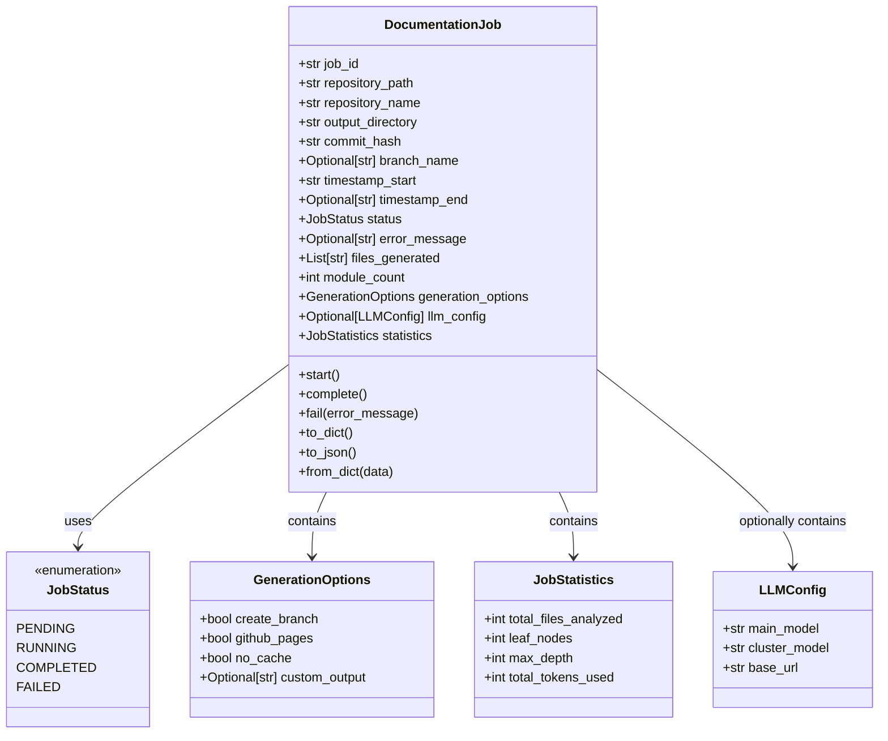
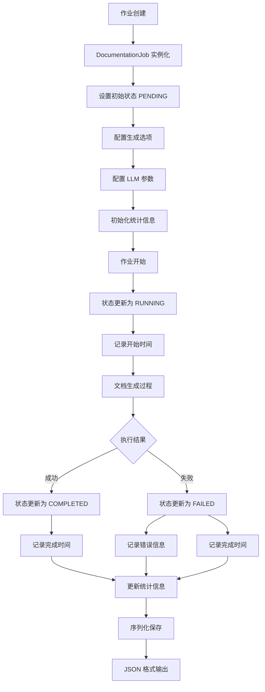
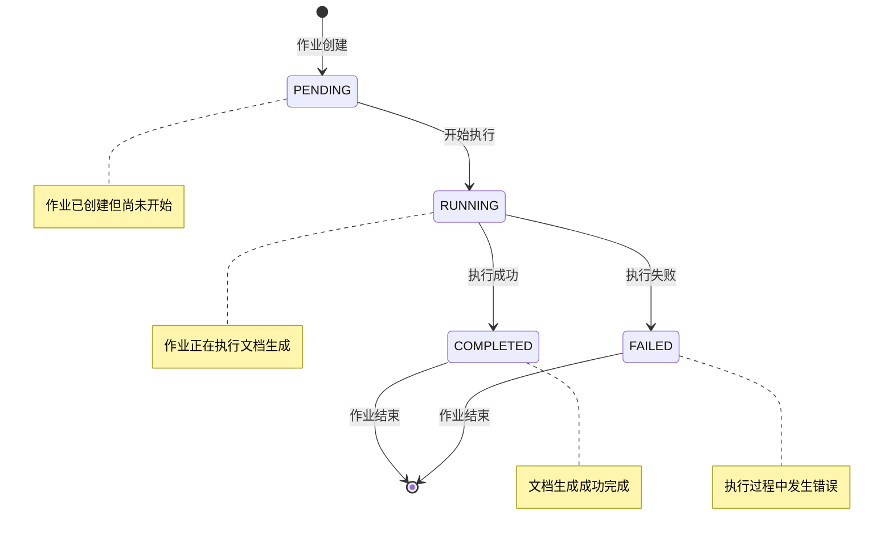
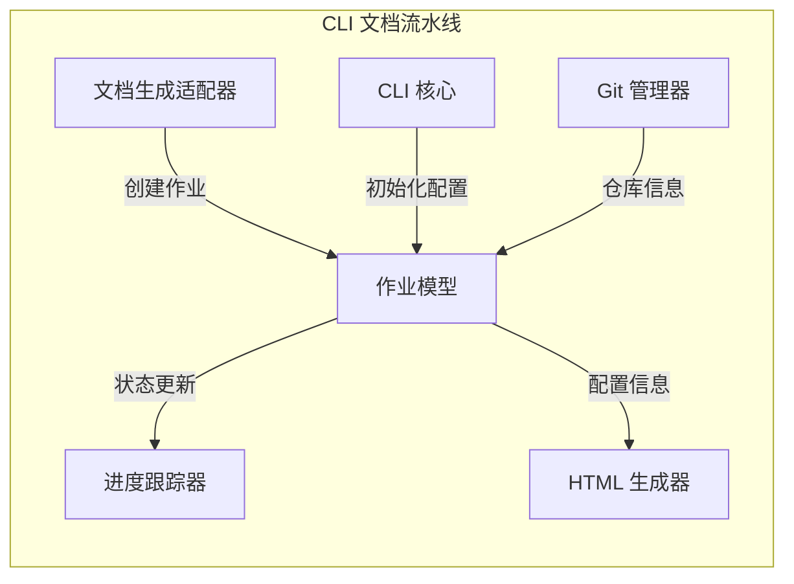
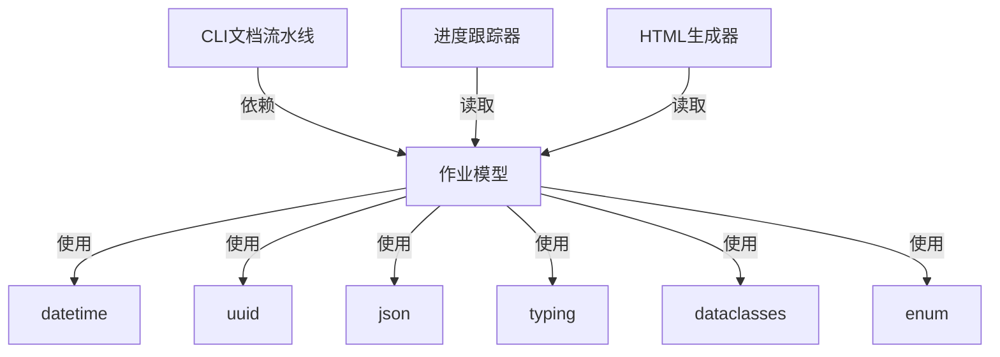

# 作业模型模块文档

## 概述

作业模型模块是 CodeWiki CLI 文档生成流水线中的核心组件，负责定义和管理文档生成作业的数据结构。该模块提供了完整的作业生命周期管理，包括作业状态跟踪、配置选项管理、统计信息收集等功能。

## 核心功能

### 1. 作业生命周期管理
- **作业状态跟踪**：支持作业从创建到完成的完整状态流转
- **时间戳记录**：精确记录作业开始和结束时间
- **错误处理**：完善的错误状态管理和错误信息记录

### 2. 配置管理
- **生成选项**：灵活的文档生成配置选项
- **LLM 配置**：支持不同模型和集群的配置管理
- **序列化支持**：支持 JSON 格式的数据序列化和反序列化

### 3. 统计信息
- **文件分析统计**：记录分析的文件总数
- **性能指标**：跟踪最大深度、叶节点数量等关键指标
- **资源使用**：记录使用的 Token 数量等资源消耗

## 核心组件

### DocumentationJob（文档作业）

`DocumentationJob` 是模块的核心类，代表一个完整的文档生成作业。它封装了作业执行所需的所有信息和状态。

#### 主要属性

| 属性 | 类型 | 说明 |
|------|------|------|
| job_id | str | 唯一作业标识符，自动生成 UUID |
| repository_path | str | 仓库的绝对路径 |
| repository_name | str | 仓库名称 |
| output_directory | str | 输出目录路径 |
| commit_hash | str | Git 提交 SHA |
| branch_name | Optional[str] | Git 分支名称（可选） |
| timestamp_start | str | 作业开始时间 |
| timestamp_end | Optional[str] | 作业结束时间（完成后） |
| status | JobStatus | 当前作业状态 |
| error_message | Optional[str] | 错误信息（失败时） |
| files_generated | List[str] | 生成的文件列表 |
| module_count | int | 已记录模块数量 |
| generation_options | GenerationOptions | 生成选项配置 |
| llm_config | Optional[LLMConfig] | LLM 配置 |
| statistics | JobStatistics | 作业统计信息 |

#### 核心方法

```python
def start(self):
    """标记作业开始"""
    self.status = JobStatus.RUNNING
    self.timestamp_start = datetime.now().isoformat()

def complete(self):
    """标记作业完成"""
    self.status = JobStatus.COMPLETED
    self.timestamp_end = datetime.now().isoformat()

def fail(self, error_message: str):
    """标记作业失败"""
    self.status = JobStatus.FAILED
    self.error_message = error_message
    self.timestamp_end = datetime.now().isoformat()

def to_dict(self) -> Dict[str, Any]:
    """转换为字典以便 JSON 序列化"""
    # 实现序列化逻辑

def to_json(self) -> str:
    """转换为 JSON 字符串"""
    return json.dumps(self.to_dict(), indent=2)

@classmethod
def from_dict(cls, data: Dict[str, Any]) -> 'DocumentationJob':
    """从字典创建 DocumentationJob 实例"""
    # 实现反序列化逻辑
```

### JobStatus（作业状态）

枚举类，定义了作业可能的状态：

- **PENDING** (`"pending"`)：作业待处理
- **RUNNING** (`"running"`)：作业正在运行
- **COMPLETED** (`"completed"`)：作业已完成
- **FAILED** (`"failed"`)：作业失败

### GenerationOptions（生成选项）

配置文档生成的各种选项：

| 属性 | 类型 | 默认值 | 说明 |
|------|------|--------|------|
| create_branch | bool | False | 是否创建新分支 |
| github_pages | bool | False | 是否启用 GitHub Pages |
| no_cache | bool | False | 是否禁用缓存 |
| custom_output | Optional[str] | None | 自定义输出路径 |

### JobStatistics（作业统计）

记录作业执行过程中的统计信息：

| 属性 | 类型 | 默认值 | 说明 |
|------|------|--------|------|
| total_files_analyzed | int | 0 | 分析的文件总数 |
| leaf_nodes | int | 0 | 叶节点数量 |
| max_depth | int | 0 | 最大深度 |
| total_tokens_used | int | 0 | 使用的 Token 总数 |

### LLMConfig（LLM 配置）

配置 LLM 模型相关参数：

| 属性 | 类型 | 说明 |
|------|------|------|
| main_model | str | 主模型名称 |
| cluster_model | str | 集群模型名称 |
| base_url | str | 基础 URL |

## 架构设计

### 类关系图



### 数据流图



### 状态流转图



## 模块集成

### 与 CLI 文档流水线的集成

作业模型模块作为 [CLI 文档流水线](cli_doc_pipeline.md) 的核心数据载体，与其他组件的集成关系：



### 依赖关系



## 使用示例

### 基本使用

```python
from codewiki.cli.models.job import DocumentationJob, GenerationOptions, LLMConfig

# 创建作业配置
generation_options = GenerationOptions(
    create_branch=True,
    github_pages=True,
    no_cache=False
)

# 配置 LLM
llm_config = LLMConfig(
    main_model="gpt-4",
    cluster_model="gpt-3.5-turbo",
    base_url="https://api.openai.com/v1"
)

# 创建文档作业
job = DocumentationJob(
    repository_path="/path/to/repo",
    repository_name="my-project",
    output_directory="/output/docs",
    commit_hash="abc123",
    branch_name="main",
    generation_options=generation_options,
    llm_config=llm_config
)

# 开始作业
job.start()

# 模拟文档生成过程
try:
    # 执行文档生成逻辑
    job.statistics.total_files_analyzed = 150
    job.statistics.leaf_nodes = 45
    job.statistics.max_depth = 8
    job.files_generated = ["module1.md", "module2.md", "module3.md"]
    job.module_count = 3
    
    # 完成作业
    job.complete()
    
except Exception as e:
    # 处理失败情况
    job.fail(str(e))

# 序列化保存
json_data = job.to_json()
print(json_data)
```

### 从 JSON 恢复作业

```python
import json

# 从 JSON 字符串恢复作业
json_str = '''
{
    "job_id": "123e4567-e89b-12d3-a456-426614174000",
    "repository_path": "/path/to/repo",
    "repository_name": "my-project",
    "status": "completed",
    "timestamp_start": "2024-01-01T10:00:00",
    "timestamp_end": "2024-01-01T10:30:00",
    "files_generated": ["module1.md", "module2.md"],
    "module_count": 2,
    "statistics": {
        "total_files_analyzed": 100,
        "leaf_nodes": 30,
        "max_depth": 5,
        "total_tokens_used": 5000
    }
}
'''

data = json.loads(json_str)
restored_job = DocumentationJob.from_dict(data)
print(f"作业状态: {restored_job.status}")
print(f"生成文件: {restored_job.files_generated}")
```

## 最佳实践

### 1. 作业状态管理
- 始终使用提供的方法（`start()`、`complete()`、`fail()`）来更新作业状态
- 在状态转换时自动更新时间戳，确保时间记录的准确性
- 失败时提供详细的错误信息，便于问题排查

### 2. 统计信息收集
- 在文档生成过程中实时更新统计信息
- 重点关注性能指标，如文件分析数量和 Token 使用量
- 利用统计信息进行性能优化和资源规划

### 3. 配置管理
- 根据项目需求合理配置生成选项
- 为不同的 LLM 模型配置合适的参数
- 利用配置选项控制生成行为，如缓存策略和输出路径

### 4. 错误处理
- 使用 try-except 块捕获可能的异常
- 在失败时记录详细的错误信息和堆栈跟踪
- 提供清晰的错误消息，便于用户理解和解决问题

### 5. 数据持久化
- 定期将作业状态序列化保存，防止数据丢失
- 使用 JSON 格式便于跨平台数据交换
- 实现从持久化数据恢复作业状态的能力

## 扩展性考虑

### 1. 状态扩展
可以通过扩展 `JobStatus` 枚举来支持更多的作业状态，如：
- `PAUSED`：作业暂停
- `CANCELLED`：作业取消
- `RETRYING`：作业重试中

### 2. 统计信息扩展
`JobStatistics` 可以根据需要添加更多统计维度：
- 平均处理时间
- 内存使用量
- 网络请求次数
- 缓存命中率

### 3. 配置选项扩展
`GenerationOptions` 可以添加更多控制选项：
- 并发度设置
- 超时时间配置
- 质量阈值设定
- 模板选择选项

## 相关模块

- [CLI 文档流水线](cli_doc_pipeline.md)：包含作业模型模块的完整文档生成流水线
- [进度跟踪器](cli_doc_pipeline.md#进度跟踪器)：读取作业状态并显示进度信息
- [HTML 生成器](cli_doc_pipeline.md#html-生成器)：使用作业配置生成 HTML 文档
- [CLI 核心](cli_core.md)：提供作业初始化所需的配置管理

## 总结

作业模型模块为 CodeWiki 的文档生成系统提供了坚实的数据基础。通过精心设计的类结构和状态管理机制，它能够有效支撑复杂的文档生成流程，为系统的可靠性、可扩展性和可维护性提供了重要保障。模块的设计遵循了单一职责原则和开闭原则，使得未来功能的扩展和修改变得简单和安全。