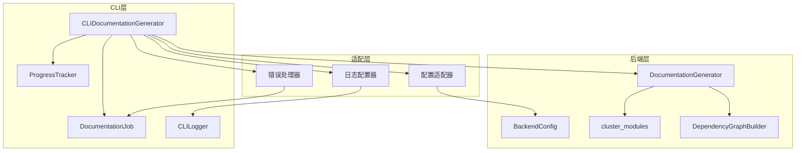
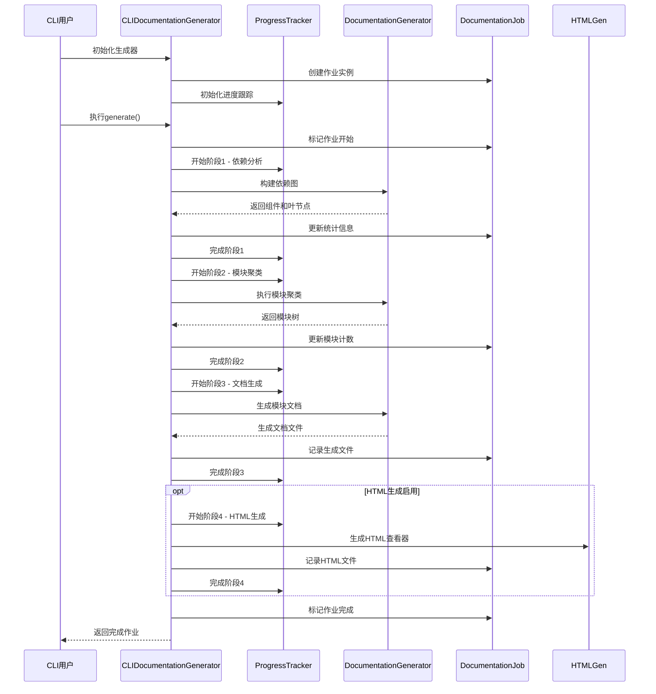
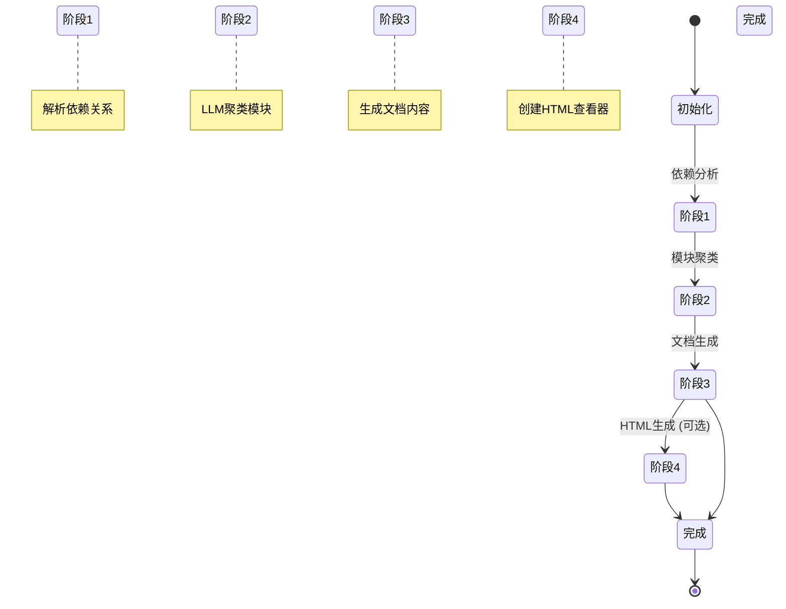
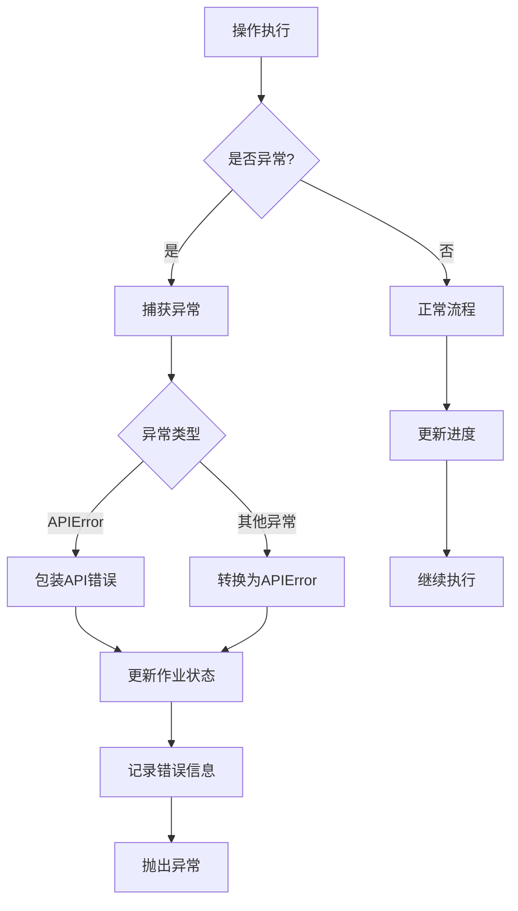

# 文档生成适配器模块

## 简介

文档生成适配器模块是CodeWiki CLI系统的核心组件，负责将后端文档生成功能封装为CLI友好的接口。该模块通过提供进度跟踪、错误处理和CLI特定的日志配置，桥接了底层文档生成引擎与命令行用户界面之间的鸿沟。

## 核心功能

### 主要特性
- **进度跟踪**: 实时显示文档生成各阶段的进度状态
- **错误处理**: 统一的异常处理和错误报告机制
- **日志配置**: CLI特定的日志格式化和级别控制
- **多阶段处理**: 支持依赖分析、模块聚类、文档生成、HTML生成等完整流程
- **配置管理**: 集成CLI配置与后端配置的转换适配

### 支持的文档生成阶段
1. **依赖分析**: 解析源代码依赖关系，构建依赖图
2. **模块聚类**: 使用LLM智能聚类相关模块
3. **文档生成**: 生成模块级和组件级文档
4. **HTML生成** (可选): 创建交互式HTML查看器
5. **完成处理**: 生成元数据和统计信息

## 架构设计

### 组件结构



### 数据流图



## 核心组件详解

### CLIDocumentationGenerator

`CLIDocumentationGenerator`是模块的核心类，负责协调整个文档生成流程。

#### 主要职责
- **流程协调**: 管理5个主要阶段的执行顺序
- **配置适配**: 将CLI配置转换为后端配置格式
- **进度管理**: 通过ProgressTracker实时更新进度状态
- **错误处理**: 捕获并包装异常为APIError
- **日志管理**: 配置后端日志器以适应CLI环境

#### 初始化参数
```python
def __init__(
    self,
    repo_path: Path,          # 仓库路径
    output_dir: Path,         # 输出目录
    config: Dict[str, Any],   # LLM配置
    verbose: bool = False,    # 详细输出模式
    generate_html: bool = False  # 是否生成HTML
)
```

#### 主要方法
- `generate()`: 执行完整的文档生成流程
- `_run_backend_generation()`: 运行后端文档生成
- `_run_html_generation()`: 生成HTML查看器
- `_configure_backend_logging()`: 配置后端日志

### 进度跟踪机制

进度跟踪采用5阶段模型，每个阶段都有明确的开始、更新和完成状态：



### 日志配置策略

模块实现了智能的日志配置策略，根据verbose模式调整日志级别和输出格式：

#### Verbose模式
- **日志级别**: INFO及以上
- **输出流**: stdout
- **格式化**: 彩色格式化器
- **后端日志**: 完全启用

#### 非Verbose模式
- **日志级别**: WARNING及以上
- **输出流**: stderr
- **格式化**: 彩色格式化器（仅警告和错误）
- **后端日志**: 抑制INFO/DEBUG消息

## 依赖关系

### 内部依赖
- **[作业模型](作业模型.md)**: DocumentationJob、LLMConfig等作业相关模型
- **[进度跟踪器](进度跟踪器.md)**: ProgressTracker和ModuleProgressBar
- **[配置管理器](cli_core.md)**: 配置管理和验证

### 后端依赖
- **[文档生成器](be_doc_generator.md)**: 核心文档生成逻辑
- **[依赖分析器](be_dependency_analyzer.md)**: 代码依赖分析
- **[配置模块](be_config.md)**: 后端配置管理

### 外部依赖
- `codewiki.src.be.cluster_modules`: 模块聚类功能
- `codewiki.src.utils.file_manager`: 文件管理工具

## 错误处理

### 异常类型
- **APIError**: LLM API调用失败
- **依赖分析异常**: 代码解析错误
- **模块聚类异常**: LLM聚类失败
- **文件系统异常**: 读写权限问题

### 错误处理流程


## 配置管理

### CLI到后端配置转换
适配器负责将CLI配置字典转换为后端Configuration对象：

```python
# CLI配置结构
cli_config = {
    'main_model': 'gpt-4',
    'cluster_model': 'gpt-3.5-turbo',
    'base_url': 'https://api.openai.com',
    'api_key': 'sk-...',
    'fallback_model': 'gpt-3.5-turbo'
}

# 转换为后端配置
backend_config = BackendConfig.from_cli(
    repo_path=str(repo_path),
    output_dir=str(output_dir),
    llm_base_url=cli_config.get('base_url'),
    llm_api_key=cli_config.get('api_key'),
    main_model=cli_config.get('main_model'),
    cluster_model=cli_config.get('cluster_model'),
    fallback_model=cli_config.get('fallback_model')
)
```

### 上下文管理
通过`set_cli_context()`函数设置CLI上下文，影响后端行为：
- **日志级别**: 调整日志输出详细程度
- **错误处理**: 启用CLI友好的错误消息
- **进度报告**: 启用进度回调机制

## 性能优化

### 异步处理
- 使用`asyncio.run()`执行后端异步操作
- 避免阻塞CLI界面
- 支持并发文档生成

### 缓存机制
- 模块树缓存: 避免重复聚类计算
- 文件系统缓存: 减少I/O操作
- 配置缓存: 避免重复配置解析

### 内存管理
- 流式处理大文件
- 及时清理临时数据
- 控制并发度

## 扩展性

### 插件架构
适配器设计支持未来扩展：
- **新输出格式**: 支持除HTML外的其他格式
- **新分析器**: 集成其他依赖分析工具
- **新聚类算法**: 替换或增强LLM聚类

### 配置扩展
- 动态配置验证
- 插件配置支持
- 环境变量集成

## 使用示例

### 基本使用
```python
from pathlib import Path
from codewiki.cli.adapters.doc_generator import CLIDocumentationGenerator

# 初始化生成器
generator = CLIDocumentationGenerator(
    repo_path=Path("./my-repo"),
    output_dir=Path("./docs"),
    config={
        'main_model': 'gpt-4',
        'cluster_model': 'gpt-3.5-turbo',
        'base_url': 'https://api.openai.com',
        'api_key': 'your-api-key'
    },
    verbose=True,
    generate_html=True
)

# 执行生成
job = generator.generate()
print(f"生成了 {len(job.files_generated)} 个文件")
```

### 错误处理
```python
try:
    job = generator.generate()
    if job.status == 'completed':
        print("文档生成成功!")
    else:
        print(f"生成失败: {job.error_message}")
except APIError as e:
    print(f"API错误: {e}")
except Exception as e:
    print(f"未知错误: {e}")
```

## 最佳实践

### 配置建议
1. **模型选择**: 主模型选择GPT-4，聚类模型选择GPT-3.5-Turbo以平衡质量和成本
2. **输出目录**: 使用独立的文档输出目录，避免污染源码
3. **日志级别**: 开发阶段启用verbose模式，生产环境关闭

### 性能调优
1. **大仓库处理**: 分批处理大文件，避免内存溢出
2. **并发控制**: 根据系统资源调整并发度
3. **缓存利用**: 充分利用模块树缓存避免重复计算

### 错误预防
1. **API密钥**: 使用环境变量存储敏感信息
2. **路径验证**: 确保输入输出路径有效且可写
3. **网络超时**: 配置合理的API超时时间

## 总结

文档生成适配器模块通过精心设计的适配层，成功地将复杂的后端文档生成功能封装为简单易用的CLI接口。其模块化的架构、完善的错误处理、智能的进度跟踪和灵活的日志配置，使其成为CodeWiki CLI系统的核心支柱。该模块不仅提供了强大的文档生成能力，还为未来的功能扩展奠定了坚实的基础。