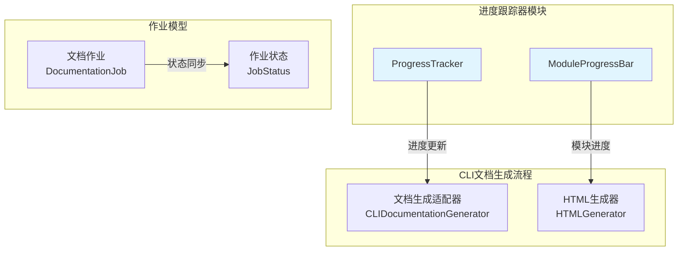
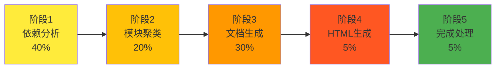
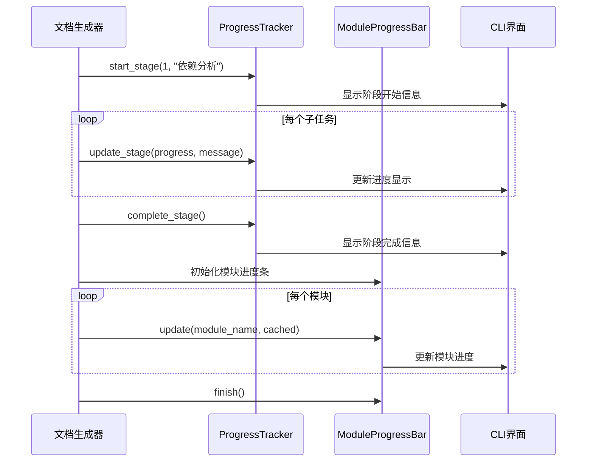
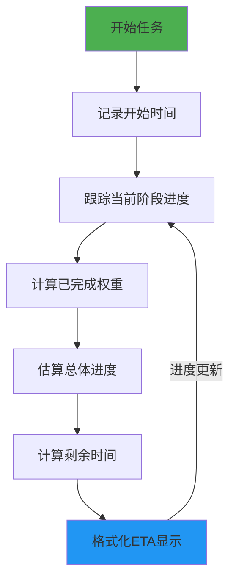

# 进度跟踪器模块文档

## 概述

进度跟踪器模块是 CodeWiki CLI 文档生成流程中的核心组件，负责提供详细的进度指示和完成时间估算功能。该模块通过两个主要组件——`ProgressTracker` 和 `ModuleProgressBar`——为复杂的文档生成过程提供可视化的进度反馈。

## 核心功能

### 1. 多阶段进度跟踪
- **分阶段跟踪**：将整个文档生成过程分解为5个主要阶段
- **权重分配**：每个阶段根据预期耗时分配不同的权重
- **实时估算**：基于当前进度动态计算剩余时间（ETA）

### 2. 模块级进度显示
- **模块进度条**：为批量模块处理提供可视化进度条
- **缓存状态显示**：区分已缓存和新生成的模块
- **详细模式**：支持详细输出模式，显示每个模块的处理状态

## 架构设计

### 组件结构



### 进度阶段划分



## 核心组件详解

### ProgressTracker 类

`ProgressTracker` 是整个模块的核心，负责跟踪多阶段任务的进度。

#### 主要特性

1. **阶段权重系统**
   - 依赖分析：40%（最耗时）
   - 模块聚类：20%
   - 文档生成：30%
   - HTML生成：5%（可选）
   - 完成处理：5%

2. **时间估算算法**
   - 基于历史数据计算平均处理时间
   - 动态调整剩余时间估算
   - 支持多种时间格式显示

3. **输出格式化**
   - 详细模式：显示详细的时间戳和阶段信息
   - 简洁模式：仅显示关键进度信息
   - 彩色输出：使用不同颜色区分状态

#### 使用示例

```python
# 初始化进度跟踪器
tracker = ProgressTracker(total_stages=5, verbose=True)

# 开始第一阶段
tracker.start_stage(1, "正在分析代码依赖关系")

# 更新阶段进度
tracker.update_stage(0.5, "已处理50%的文件")

# 完成阶段
tracker.complete_stage("依赖分析完成")

# 获取总体进度
overall_progress = tracker.get_overall_progress()  # 返回 0.2 (20%)
```

### ModuleProgressBar 类

`ModuleProgressBar` 专注于模块级别的进度显示，适用于批量处理场景。

#### 主要特性

1. **进度条显示**
   - 基于 Click 库的专业进度条
   - 实时更新处理进度
   - 显示完成百分比和预计剩余时间

2. **缓存状态识别**
   - 区分已缓存模块（✓）和新生成模块（⟳）
   - 在详细模式下显示具体状态信息

3. **资源管理**
   - 自动管理进度条生命周期
   - 支持异常安全清理

#### 使用示例

```python
# 初始化模块进度条
progress_bar = ModuleProgressBar(total_modules=100, verbose=False)

# 更新模块进度
progress_bar.update("user_service.py", cached=True)
progress_bar.update("auth_module.py", cached=False)

# 完成进度条
progress_bar.finish()
```

## 数据流与交互

### 进度更新流程



### 时间估算机制



## 配置与使用

### 初始化参数

#### ProgressTracker 参数
- `total_stages`: 总阶段数（默认：5）
- `verbose`: 是否启用详细输出模式（默认：False）

#### ModuleProgressBar 参数
- `total_modules`: 待处理模块总数
- `verbose`: 是否启用详细输出模式（默认：False）

### 输出模式对比

| 模式 | 特点 | 适用场景 |
|------|------|----------|
| 简洁模式 | 单行显示，进度条形式 | 普通用户，标准输出 |
| 详细模式 | 多行详细输出，带时间戳 | 调试模式，详细日志 |

## 集成指南

### 与文档生成流程集成

进度跟踪器模块与 [文档生成适配器](cli_doc_pipeline.md#文档生成适配器) 紧密集成，为整个文档生成流程提供进度反馈。

### 与作业模型协同

进度信息会同步更新到 [作业模型](cli_doc_pipeline.md#作业模型) 中的作业状态，确保前端界面能够实时显示处理进度。

## 最佳实践

### 1. 阶段划分原则
- 根据实际耗时合理分配权重
- 保持阶段划分的稳定性
- 为可选阶段提供标识机制

### 2. 进度更新策略
- 在关键节点更新进度
- 避免过于频繁的更新
- 提供有意义的进度信息

### 3. 错误处理
- 确保进度条正确清理
- 在异常情况下保持状态一致性
- 提供清晰的错误信息

## 性能考虑

### 内存使用
- 进度跟踪器保持最小内存占用
- 及时清理已完成的进度信息
- 避免在内存中累积大量历史数据

### 计算效率
- 时间估算算法保持简单高效
- 避免复杂的数学运算
- 使用增量更新策略

## 扩展性

### 自定义阶段
支持通过继承扩展新的阶段类型：

```python
class CustomProgressTracker(ProgressTracker):
    STAGE_WEIGHTS = {
        **ProgressTracker.STAGE_WEIGHTS,
        6: 0.10  # 新增阶段
    }
    
    STAGE_NAMES = {
        **ProgressTracker.STAGE_NAMES,
        6: "自定义处理"
    }
```

### 输出格式化
支持自定义输出格式和样式，适应不同的集成需求。

## 相关模块

- [CLI文档生成流程](cli_doc_pipeline.md) - 主要使用方
- [作业模型](cli_doc_pipeline.md#作业模型) - 状态同步
- [CLI核心组件](cli_core.md) - 配置和日志集成

## 总结

进度跟踪器模块通过精心设计的双组件架构，为 CodeWiki 的文档生成流程提供了专业、可靠的进度指示功能。其灵活的权重分配系统和智能的时间估算机制，确保了用户能够获得准确、实时的进度反馈，提升了整体用户体验。